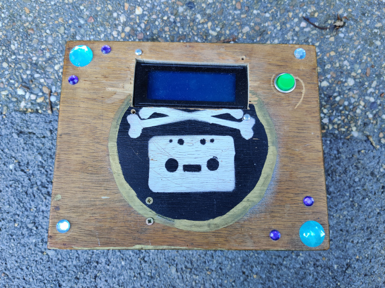
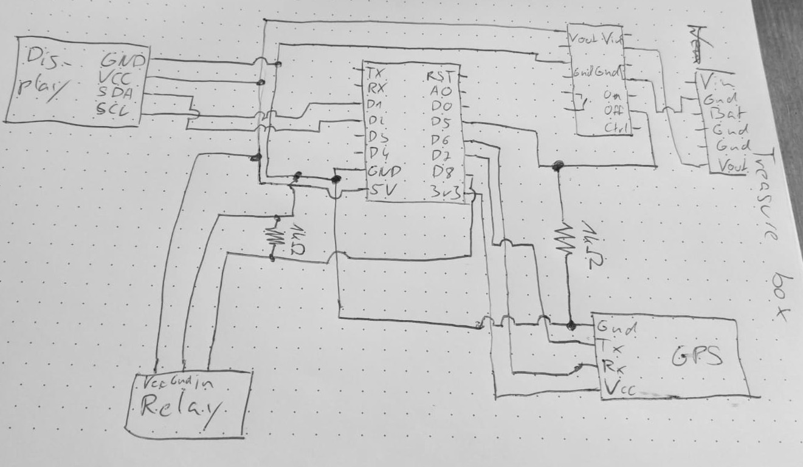

This is my recreation of [Mikal Hart's reverse geocache puzzle](http://arduiniana.org/projects/the-reverse-geo-cache-puzzle/).

The basic idea is to create a box that is locked from the inside, and only opens when brought to the right location. For this purpose we need a few things:

1. A microcontroller (I used an ESP8266 because I had one, but since we don't need the wifi capabilities, a more powersaving alternative like an arduino nano or a stm32 would have been better)
2. A GPS module to determine the boxes position (I used a Ublox NEO6M)
3. An LCD screen to show the distance to the target and the amount of remaining tries
4. Some locking mechanism (I used a solenoid and some wood, I believe it can also be built better with servos and a kind of deadbolt system)
5. A power source (I used a lipo cell with a tp4056 module that I had laying around)
6. A power switch (a latch) that can be triggered by the microcontroller as well as a button. I used a quite expensive one made by polulu since I could not find an alternative that consumed such low power.

This is what my final box looks like from the top:

And here are some (badly drawn) schematics on how I connected it all together:

